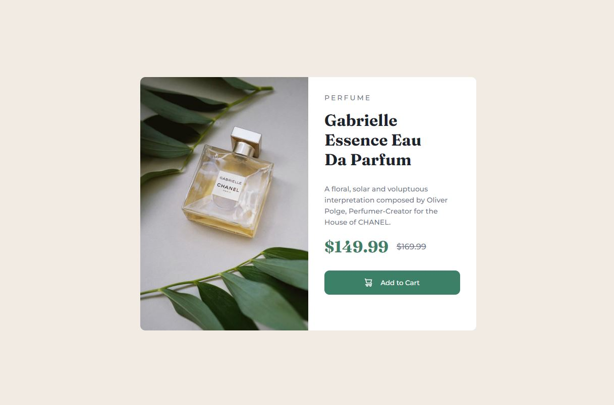
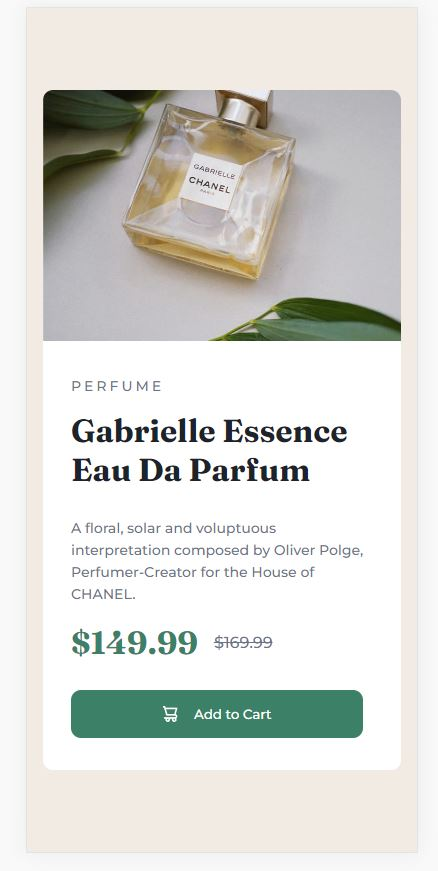

# Frontend Mentor - Product preview card component solution

This is a solution to the [Product preview card component challenge on Frontend Mentor](https://www.frontendmentor.io/challenges/product-preview-card-component-GO7UmttRfa). Frontend Mentor challenges help you improve your coding skills by building realistic projects. 

## Table of contents

- [Overview](#overview)
  - [The challenge](#the-challenge)
  - [Screenshot Results](#screenshot)
  - [Solution Links](#links)
- [My process](#my-process)
  - [Built with](#built-with)
  - [What I learned](#what-i-learned)
- [Author](#author)


## Overview

### The challenge

Users should be able to:

- View the optimal layout depending on their device's screen size
- See hover and focus states for interactive elements

### Screenshot Results




### Solution Links

- Solution URL: https://github.com/Francis-MD/Product-preview-card-component
- Live Site URL: https://francis-md.github.io/Product-preview-card-component/

## My process

### Built with

- Semantic HTML5 markup
- CSS custom properties

### What I learned

- To use and style the "button" feature with PSEUDO CLASSES in css.
- Cursor apprearance tricks.
- To manipulate @media Query for a RESPONSIVE DESIGN.

To see how you can add code snippets, see below:

```html
<h1>Some HTML code I'm proud of</h1>
  <button class="btn">
    
    Add to Cart
  </button>
```
```css
.proud-of-this-css {
  @media only screen and (max-width: 550px)...
}
```

### Continued development

To master the @media Query for more advance responsive designs and other applications.

## Author

- Website - [Francis MD](https://www.linkedin.com/in/francismd/)
- Frontend Mentor - [@Francis-MD](https://www.frontendmentor.io/profile/Francis-MD)
- Twitter - [@Francis_MD_](https://twitter.com/Francis_MD_)